# Enterprise Customer Support Bot – Architecture & Implementation Document

## 1. Project Overview

### Objective
Build an enterprise-grade Customer Support Bot capable of:

1. Answering questions from:
   - PDF documents
   - Structured databases
2. Supporting hybrid retrieval:
   - RAG (Retrieval-Augmented Generation)
   - NL2SQL (Natural Language to SQL)
3. Providing secure, validated, and explainable responses.
4. Using a generalized LLM architecture.
5. Supporting:
   - Guardrails
   - RAG Evaluation Pipeline
   - NL2SQL Validation Pipeline
   - Conversation Memory
   - Analytics & Monitoring
   - Human Escalation

---

# 2. High-Level Goals

## Functional Goals

- Upload and index PDFs.
- Extract embeddings from documents.
- Store embeddings in vector DB.
- Connect with relational database.
- Convert user query into:
  - semantic retrieval query
  - SQL query
- Generate contextual answers.
- Maintain conversation memory.
- Provide admin analytics.
- Detect hallucinations and unsafe outputs.

## Non-Functional Goals

- Scalable microservice architecture.
- Secure access control.
- Low latency retrieval.
- Production monitoring.
- Extensible for multiple LLMs.
- Cloud deployable.

---

# 3. Recommended Technology Stack

| Layer | Technology |
|---|---|
| Frontend | React / Next.js |
| Backend API | FastAPI |
| Orchestration | LangGraph / Custom Agent Engine |
| LLM | OpenAI / Llama / Mistral / Claude |
| Embedding Model | bge-large / E5 / OpenAI embeddings |
| Vector Database | Milvus / PgVector / Weaviate |
| Relational DB | PostgreSQL / MySQL |
| Cache | Redis |
| Document Parsing | PyMuPDF / Unstructured / LangChain |
| Guardrails | NeMo Guardrails / Guardrails AI |
| Observability | LangSmith / Prometheus / Grafana |
| Evaluation | RAGAS / DeepEval |
| Queue | RabbitMQ / Kafka |
| Authentication | JWT / OAuth2 |
| Deployment | Docker + Kubernetes |

---

# 4. System Architecture

## Overall Architecture Diagram

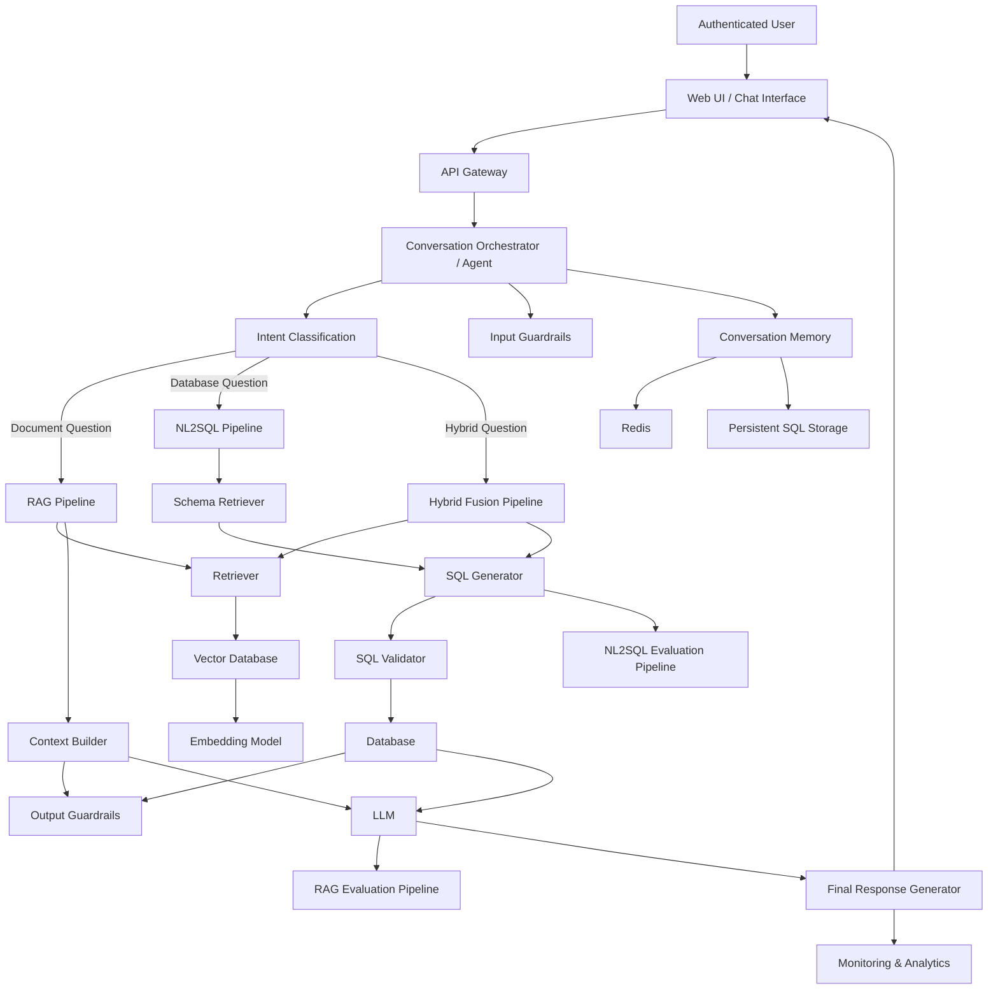

---

# 5. Detailed Component Breakdown

# 5.1 User Interface Layer

## Responsibilities

- User authentication
- Chat interface
- Feedback collection
- Chat history
- File upload
- Streaming responses

## Features

- Markdown rendering
- Source citations
- Chat export
- Multi-session support
- Admin dashboard

---

# 5.2 API Gateway Layer

## Responsibilities

- Authentication
- Rate limiting
- Request routing
- Request validation
- Logging

## Suggested APIs

| Endpoint | Purpose |
|---|---|
| /chat | Main chatbot interaction |
| /upload | Upload PDFs |
| /history | Conversation history |
| /feedback | User feedback |
| /admin | Analytics |
| /health | Health checks |

---

# 5.3 Agent Orchestrator

## Responsibilities

This is the brain of the system.

It decides:

- Whether query should use:
  - RAG
  - NL2SQL
  - Hybrid search
- Which tools to invoke
- Memory handling
- Retry logic
- Validation flow

## Suggested Workflow

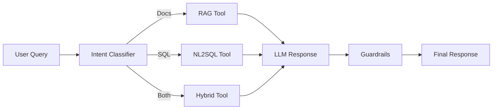

---

# 5.4 RAG Pipeline

## Architecture

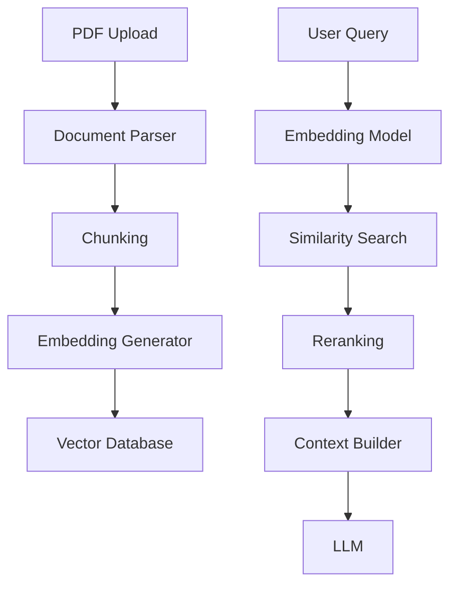

## Tasks in RAG

### Document Processing

- Parse PDFs
- OCR support
- Clean text
- Remove headers/footers
- Metadata extraction

### Chunking Strategy

Recommended:

- Chunk size: 500–1000 tokens
- Overlap: 100–200 tokens

### Retrieval Strategies

- Dense retrieval
- Hybrid retrieval
- BM25 + embeddings
- Reranking

### Metadata

Store:

- file name
- page number
- section
- upload date
- version

---

# 5.5 NL2SQL Pipeline

## Architecture

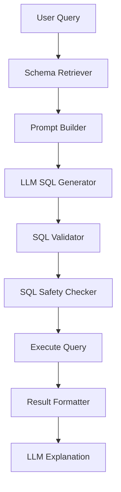

## NL2SQL Flow

### Step 1: Schema Retrieval

Retrieve:

- table names
- columns
- relationships
- sample rows

### Step 2: SQL Generation

LLM generates SQL.

### Step 3: SQL Validation

Validation includes:

- Syntax validation
- SQL parsing
- Allowed tables only
- Allowed columns only
- Prevent DELETE/UPDATE/DROP
- LIMIT enforcement
- Query timeout

### Step 4: Query Execution

Execute only validated queries.

### Step 5: Response Formatting

Convert result into conversational response.

---

# 6. Guardrails Architecture

## Objectives

Prevent:

- Hallucinations
- Prompt injection
- Data leakage
- Toxic outputs
- SQL injection
- Jailbreaks
- Unsafe responses

---

## Guardrails Flow

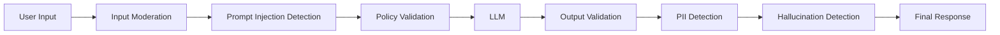

---

## Input Guardrails

### Checks

- Toxicity
- Abuse
- SQL injection attempts
- Prompt injection
- Sensitive data detection
- PII detection

### Example Rules

- Reject system prompt exposure attempts
- Block harmful instructions
- Restrict unsupported domains

---

## Output Guardrails

### Checks

- Hallucination score
- Citation verification
- Toxicity detection
- PII masking
- Response relevance

---

# 7. RAG Evaluation Pipeline

## Goal

Continuously measure retrieval and answer quality.

---

## RAG Evaluation Architecture

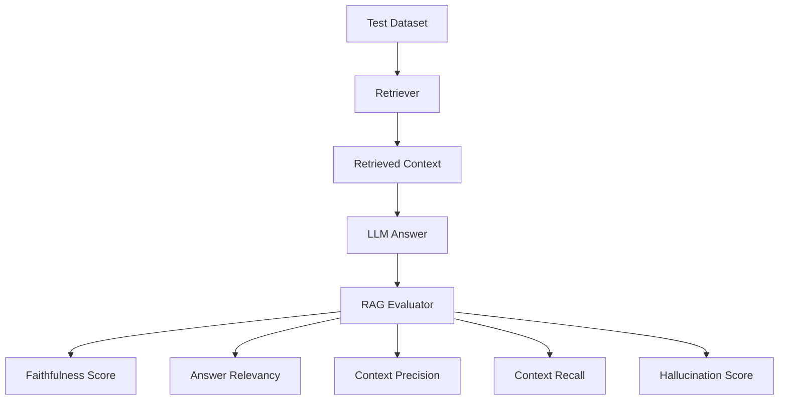

---

## Metrics

| Metric | Description |
|---|---|
| Faithfulness | Answer supported by context |
| Context Recall | Relevant documents retrieved |
| Context Precision | Noise reduction |
| Answer Relevancy | Query-answer alignment |
| Hallucination Rate | Unsupported claims |
| Latency | Response time |

---

## Recommended Tools

| Tool | Purpose |
|---|---|
| RAGAS | RAG evaluation |
| DeepEval | LLM evaluation |
| LangSmith | Tracing |
| Phoenix | Observability |

---

# 8. NL2SQL Validation Pipeline

## Objectives

Ensure generated SQL is:

- Safe
- Correct
- Efficient
- Authorized

---

## Validation Architecture

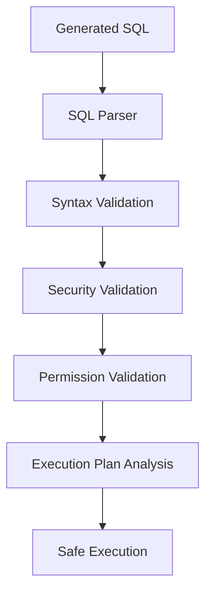

---

## Validation Rules

### Allowed

- SELECT
- Aggregations
- GROUP BY
- LIMIT

### Blocked

- DELETE
- UPDATE
- DROP
- ALTER
- TRUNCATE

### Additional Checks

- Max rows
- Timeout
- Table whitelist
- Role-based access

---

# 9. Memory Architecture

## Types of Memory

| Memory Type | Storage |
|---|---|
| Short-term Memory | Redis |
| Long-term Memory | PostgreSQL |
| Session State | Redis |
| User Preferences | SQL DB |

---

## Memory Workflow

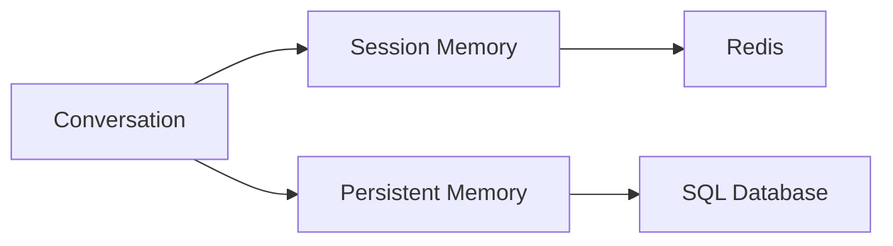

---

# 10. Admin & Analytics System

## Features

- Conversation analytics
- User feedback tracking
- Guardrail violation reports
- Token usage monitoring
- Latency monitoring
- Top failed queries
- Hallucination reports

---

## Admin Dashboard KPIs

| KPI | Description |
|---|---|
| Total Queries | Overall usage |
| Avg Response Time | Latency |
| Hallucination Rate | Quality metric |
| Guardrail Violations | Security tracking |
| Retrieval Accuracy | RAG quality |
| SQL Failure Rate | NL2SQL health |
| User Satisfaction | Feedback metric |

---

# 11. Microservice Architecture

## Suggested Services

| Service | Responsibility |
|---|---|
| Auth Service | Authentication |
| Chat Service | Main chatbot APIs |
| RAG Service | Document retrieval |
| Embedding Service | Embedding generation |
| SQL Service | NL2SQL processing |
| Guardrail Service | Validation |
| Evaluation Service | Quality checks |
| Analytics Service | Monitoring |
| Admin Service | Dashboard |

---

# 12. Database Design

## Core Tables

### users

| Column | Type |
|---|---|
| user_id | UUID |
| name | TEXT |
| role | TEXT |
| created_at | TIMESTAMP |

### conversations

| Column | Type |
|---|---|
| conversation_id | UUID |
| user_id | UUID |
| created_at | TIMESTAMP |

### messages

| Column | Type |
|---|---|
| message_id | UUID |
| conversation_id | UUID |
| role | TEXT |
| content | TEXT |
| timestamp | TIMESTAMP |

### feedback

| Column | Type |
|---|---|
| feedback_id | UUID |
| message_id | UUID |
| rating | INTEGER |
| comments | TEXT |

### documents

| Column | Type |
|---|---|
| document_id | UUID |
| filename | TEXT |
| upload_time | TIMESTAMP |
| status | TEXT |

---

# 13. Deployment Architecture

## Kubernetes Deployment

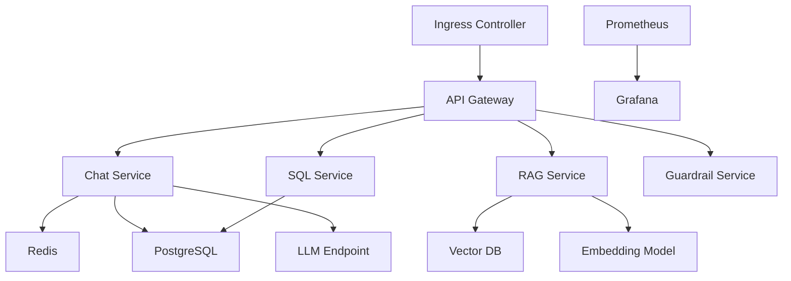

---

# 14. CI/CD Pipeline

## Pipeline Stages

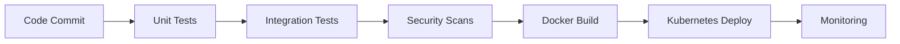

---

# 15. End-to-End Execution Flow

## Complete Query Lifecycle

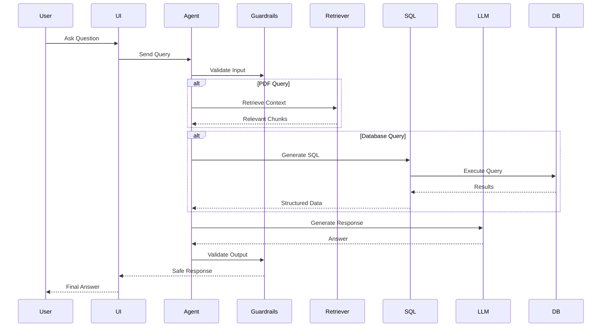

---

# 16. Project Task Breakdown

# Phase 1 – Requirement Gathering

## Tasks

- Define business use cases
- Identify data sources
- Define supported query types
- Define security requirements
- Finalize architecture

---

# Phase 2 – Infrastructure Setup

## Tasks

- Setup repositories
- Setup Docker
- Setup Kubernetes
- Configure PostgreSQL
- Configure Redis
- Configure Vector DB
- Setup CI/CD
- Setup monitoring

---

# Phase 3 – Document Processing Pipeline

## Tasks

- PDF parser implementation
- OCR integration
- Chunking strategy
- Metadata extraction
- Embedding generation
- Vector indexing
- Retrieval APIs

---

# Phase 4 – NL2SQL System

## Tasks

- Schema extraction
- Prompt engineering
- SQL generation engine
- SQL parser
- SQL validator
- Query execution layer
- Result formatter

---

# Phase 5 – Agent Framework

## Tasks

- Intent classification
- Tool routing
- Hybrid orchestration
- Conversation memory
- Retry logic
- Fallback handling

---

# Phase 6 – Guardrails

## Tasks

- Input moderation
- Prompt injection protection
- PII masking
- Output moderation
- Hallucination checks
- SQL safety rules

---

# Phase 7 – Evaluation Pipelines

## Tasks

### RAG Evaluation

- Benchmark dataset
- RAGAS integration
- Faithfulness checks
- Retrieval scoring

### NL2SQL Evaluation

- SQL correctness benchmark
- Execution validation
- Semantic accuracy testing

---

# Phase 8 – Frontend Development

## Tasks

- Chat UI
- Authentication
- File upload UI
- Admin dashboard
- Analytics visualization
- Feedback forms

---

# Phase 9 – Monitoring & Analytics

## Tasks

- Logging
- Metrics collection
- Distributed tracing
- Dashboard setup
- Alerting system

---

# Phase 10 – Production Deployment

## Tasks

- Load testing
- Security testing
- Scaling validation
- Kubernetes deployment
- Backup strategy
- Disaster recovery

---

# 17. Recommended Folder Structure

```text
project/
│
├── backend/
│   ├── api/
│   ├── rag/
│   ├── nl2sql/
│   ├── guardrails/
│   ├── evaluation/
│   ├── memory/
│   ├── analytics/
│   └── models/
│
├── frontend/
│
├── infrastructure/
│   ├── docker/
│   ├── kubernetes/
│   └── terraform/
│
├── datasets/
├── tests/
├── docs/
└── scripts/
```

---

# 18. Security Best Practices

## Mandatory Controls

- JWT authentication
- RBAC authorization
- HTTPS everywhere
- SQL query restrictions
- Rate limiting
- PII masking
- Audit logging
- Secure secrets management

---

# 19. Future Enhancements

## Advanced Features

- Voice support
- Multilingual chatbot
- Multi-agent orchestration
- GraphRAG
- Real-time streaming retrieval
- Fine-tuned domain LLM
- Human-in-the-loop review
- Automated retraining pipeline

---

# 20. Final Recommended Architecture

## Best Production Flow

1. User asks question.
2. Agent classifies intent.
3. Query routed to:
   - RAG
   - NL2SQL
   - Hybrid
4. Guardrails validate request.
5. Retrieval/query execution occurs.
6. Context sent to LLM.
7. Output validated.
8. Response returned.
9. Evaluation metrics logged.
10. Analytics dashboard updated.

---

# 21. Suggested Development Roadmap

| Focus |
|---|
| Architecture + Infrastructure |
| RAG pipeline |
| NL2SQL pipeline |
| Agent orchestration |
| Guardrails + Evaluation |
| Frontend + Analytics |
| Optimization + Production |

---

# 22. Recommended Open Source Tools

| Category | Tool |
|---|---|
| Agent Framework | LangGraph |
| Vector DB | Milvus |
| RAG Framework | LlamaIndex |
| Guardrails | NeMo Guardrails |
| Evaluation | RAGAS |
| Monitoring | LangSmith |
| SQL Parsing | sqlglot |
| OCR | Tesseract |

---

# 23. Conclusion

This architecture provides:

- Enterprise scalability
- Secure AI interactions
- Reliable document retrieval
- Safe NL2SQL execution
- Strong guardrails
- Continuous evaluation
- Modular microservices
- Production observability

The system is designed to support generalized LLMs while maintaining enterprise-level reliability, governance, and extensibility.

